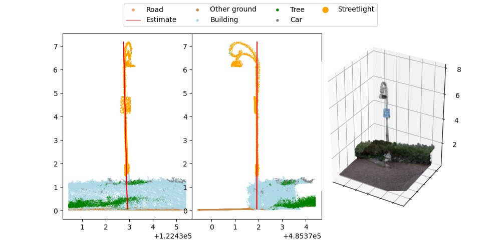

# Pole Tagger: Code to annotate extracted street lights

This repository contains a Python implementation of a pole tagger to annotate semantically segmented street lights in point clouds. 

The City of Amsterdam is responsible for managing and maintaining all street lights in the city. Using point cloud data, we help automate this process.
An initial pipeline finds objects which are likely to be street lights. It also calculates the location, height and angle of each potential street light.

In this next step, we aim to validate the extracted objects and refine these most important statistics so that everything is correct. 
This is done by iteratively inspecting all object based on 2 different perspectives, as well as a bird-eye view of the point cloud around the object.



## Preparation
This code has been tested with Python 3.10.9.

1. Clone this repository 

  ```sh
  git clone https://github.com/Amsterdam-AI-Team/pole_tagger.git
  ```

2. Install all python dependencies

  ```sh
  pip install -r requirements.txt
  ```
  
## Data
The data folder contains a csv and images subfolder:

- The csv subfolder contains the csv files with extracted street lights.
- The images subfolder contains (1) images of the extracted street lights to annotate and (2) the images of the different types of street lights.

## Usage

The tagger can be utilized with three different command line arguments depending on the task to be performed.

### Task 1: Validate poles and fits​
  ```sh
  python3 pole_tagger.py --validate_pole
  ```

The --validate_pole argument allows to label each example. The following options are available: 
- True Positive ([→], [enter], [space] or [1])
- True Positive that needs a correction ([c] or [3])
- False Positive ([f] or [2])
- Unclear example ([u] or [4])
- Previous example ([←] or [backspace])
  
### Task 2: Adjust fits
  ```sh
  python3 pole_tagger.py --adjust_fit
  ```
The --adjust_fit argument allows to refit the street light with a red line by first clicking on the bottom point and subsequently on top point. Subsequently the fitted line appears in red. The following options are then available: 
- Correct fitting ([enter] or[space])
- Incorrect fitting (any other key). This allows you to redo the fitting again.
- Not a street light ([f] or [2]). This allows you to proceed with the next example.
  
### Task 3: Validate types
  ```sh
  python3 pole_tagger.py --validate_type
  ```

The --validate_type argument allows to determine the street light type of each street light. Two windows will pop up if this argument is passed. On the left: the predicted type, on the right: the street light to assign which needs a type assignment. The following options are available:
- Correct predicted type ([enter])
- Go to next type ([→])
- Go to previous type ([←])
- Type is unkown or unclear ([1])
- Go to previous street light example ([backspace])


> **Note**
> During all three tasks, at any point you can press [escape] to exit the program. You can always resume from where you left off by running the same command. Your intermediate results are saved after every example.

> **Warning**
> You need to validate poles using the --validate_pole argument before you can use the --adjust_fit and --validate_type arguments.

Some example images have been added to this repository to get to understand the pole tagger tool.

More information about the tasks, expected results, correct and incorrect examples, as well as types of street lights can be found in the [pole tagger manual](./pole_tagger_manual.pdf).